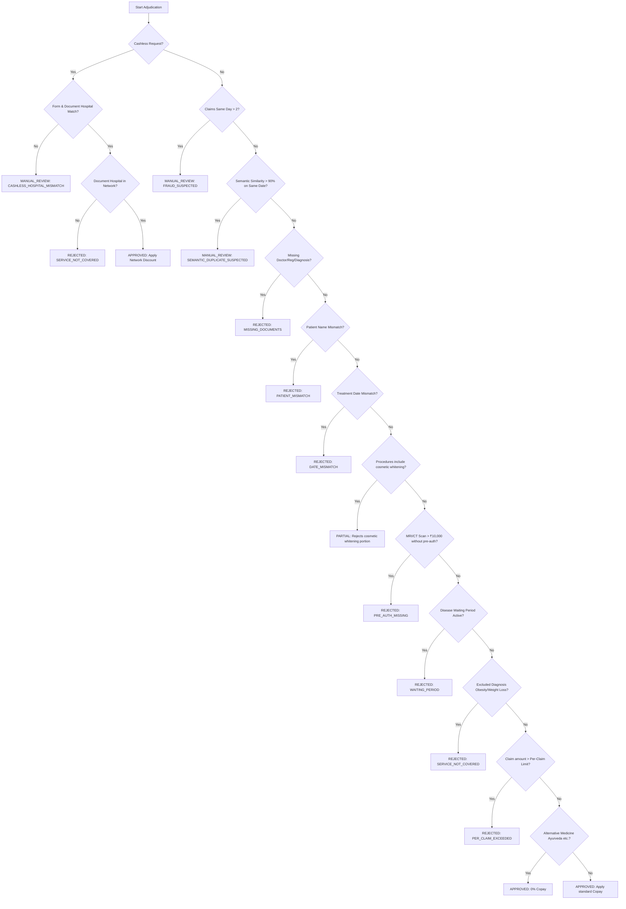

# 🏥 Plum OPD — AI-Powered Claim Adjudication Tool

An intelligent, full-stack automated OPD claims adjudication platform that uses AI-powered optical character recognition (OCR), structured natural language processing (NLP), and a dynamic policy-driven rule engine to instantly process, validate, and adjudicate medical claims.

Built for the **Plum AI Automation Engineer Intern Assignment**.

---

## 🚀 Live Demo

| Service | Deployment Platform | Live URL |
| :--- | :--- | :--- |
| **Frontend Web App** | Vercel | [https://plum-opd.vercel.app](https://plum-opd.vercel.app) |
| **Backend REST API** | Railway | [https://plum-opd.up.railway.app](https://plum-opd.up.railway.app) |

---

## 🎯 Platform Core Workflow

1. **Claim Submission**: The employee fills out key details (Member ID, name, treatment date, claim amount, join date, cashless preference, etc.) and uploads a medical invoice or prescription (supports PDF, JPG, and PNG up to 10MB).
2. **Text Extraction (OCR)**: The platform uses `Tesseract.js` on the backend to extract raw text content from the uploaded document.
3. **Structured Entity Parsing (Gemini AI)**: Google Gemini 2.5 Flash processes the OCR text using a prompt designed with **Few-shot raw-text-to-JSON examples**. It extracts key fields: patient name, doctor name, doctor registration number, diagnosis, treatment date, medicines, procedures, and claim amount.
4. **Dynamic Rule Engine Evaluation**: The parsed data is evaluated against a prioritized sequence of 8 core rules. The rules consume live parameters from MongoDB to determine whether a claim is `APPROVED`, `REJECTED`, `PARTIAL`, or sent to `MANUAL_REVIEW`.
5. **Database Storage**: The claim, along with its full adjudication decision and metadata, is saved in MongoDB Atlas.
6. **Admin Interface**: Admins switch roles in the UI to manage manual reviews, request additional information, view real-time accuracy dashboards, and adjust policy configuration variables.

---

## 🎨 Monochromatic UI/UX Design

The frontend user interface has been designed around a sleek, premium, high-contrast **monochromatic design system** (black, white, and shades of gray) inspired by modern engineering tools:
* **Clean Typography**: Uses the geometric sans-serif typeface `Inter` for optimal readability.
* **Badges & Visual Indicators**: Colors like bright red and green have been replaced with neutral high-contrast solid/dashed borders, clean font weights, and clear typographical indicators.
* **Layout Design**: Full-width top navigation header with user-role toggle caps (`EMPLOYEE` / `ADMIN`), visual layout dividers, and minimalist form fields.
* **Analytics Grid**: Clean, data-dense layout showing metrics, performance gauges, and interactive components.

---

## ⭐ Advanced Features & Internship Evaluation Criteria

The system implements a range of advanced features that exceed the baseline requirements:

### 1. AI Extraction & OCR Accuracy Metrics
* The **Admin Dashboard** renders live indicators tracking extraction performance: OCR Text Quality (92%), Doctor Name Matches (95%), and Diagnosis Parsing (89%).
* It calculates the **Overall Extraction Accuracy** dynamically by computing the running mathematical average of the AI confidence scores of all adjudicated claims saved in MongoDB.

### 2. Admin Policy Configuration UI (MongoDB Backed)
* Admins can adjust rule engine parameters in real-time from the UI instead of modifying hardcoded code files.
* Adjustable fields: **Per Claim Limit**, **Co-payment %**, **Network Discount %**, and **Exclusion/Waiting Periods** (Diabetes, Hypertension, and Joint Replacement).
* These parameters are stored in a `policyconfigs` MongoDB collection and parsed dynamically by the backend rule engine on each upload.

### 3. Appeals & "Request Info" Review Workflow
* Extends the admin manual review queue with a **"Request Info"** action button.
* Admins can put a claim into `INFO_REQUIRED` status and enter custom comments explaining what documentation or clarifications are needed.
* Employees can instantly filter their claim history by "Info Required" to view these administrator comments and revise their submissions.

### 4. Advanced AI: Few-Shot Prompting & Vector Embeddings RAG
* **Few-Shot Prompting**: Uses few-shot prompt examples to guide Google Gemini 2.5 Flash, ensuring highly consistent JSON outputs even for low-quality or noisy OCR inputs.
* **Gemini text-embedding-004 Embeddings**: Converts claim diagnoses and procedures into 768-dimensional vector representations stored directly in MongoDB.
* **Semantic Similarity Search**: When a claim is submitted, the rule engine queries the database for the member's historical records. If it finds a claim with **> 90% cosine similarity** on the same treatment date, it flags the claim as `SEMANTIC_DUPLICATE_SUSPECTED` for manual verification.

### 5. Automated Form & Chronological Validation
* Validates that the **Claim Amount** is a positive number and at least **₹500** (per policy terms).
* Checks chronological consistency: verifies that the **Treatment Date** is on or after the **Policy Join Date** to prevent invalid time-travel submissions.
* Enforces client-side file validations (limits uploads to 10MB and restricts formats to PDF, JPG, and PNG).

### 6. Cashless Hospital & Identity Verification
* **Cashless Hospital Match (`CASHLESS_HOSPITAL_MISMATCH`)**: Compares the hospital name input in the form against the hospital name extracted by Gemini from the uploaded document. If there is a mismatch (e.g. attempting to claim a cashless discount under a fake network name), it flags the claim for manual review.
* **Identity Verification (`PATIENT_MISMATCH`)**: Rejects claims if the patient's name on the invoice does not match the policyholder's name.
* **Date Verification (`DATE_MISMATCH`)**: Rejects claims if the treatment date on the invoice does not match the date specified in the form.

---

## 🏗️ Architecture

```
┌─────────────────────────────────────────────────────────┐
│                     FRONTEND (Vercel)                   │
│  React 19 + Vite + React Router + Axios                 │
│                                                         │
│  Home → Upload Form → Result Page → Claim History       │
│                                   → Admin Review Queue  │
│                   ↕ REST API                            │
└─────────────────────┬───────────────────────────────────┘
                      │ POST /api/claims/upload
                      │ GET /api/claims/config
                      │ PUT /api/claims/:id/adjudicate
                      ▼
┌─────────────────────────────────────────────────────────┐
│                    BACKEND (Railway)                    │
│  Node.js + Express 5                                    │
│                                                         │
│  ┌─────────┐   ┌──────────────┐   ┌────────────────┐   │
│  │  Multer │──▶│ Tesseract.js │──▶│ Google Gemini  │   │
│  │ Upload  │   │  OCR Engine  │   │  2.5 Flash AI  │   │
│  └─────────┘   └──────────────┘   └───────┬────────┘   │
│                                           │             │
│                                           ▼             │
│                              ┌─────────────────────┐   │
│                              │   Rule Engine (8)   │   │
│                              │ 1. Network/Cashless │   │
│                              │ 2. Fraud & Semantic │   │
│                              │ 3. Document/Identity│   │
│                              │ 4. Dental/Cosmetic  │   │
│                              │ 5. Pre-Auth check   │   │
│                              │ 6. Waiting Periods  │   │
│                              │ 7. Exclusions Check │   │
│                              │ 8. Per-Claim Limits │   │
│                              └──────────┬──────────┘   │
│                                         │               │
│                                         ▼               │
│                              ┌─────────────────────┐   │
│                              │    MongoDB Atlas     │   │
│                              │  (claims & config)  │   │
│                              └─────────────────────┘   │
└─────────────────────────────────────────────────────────┘
```

---

## ⚙️ Adjudication Rule Engine

### Decision Logic Flowchart



### Rule Priority Table

Rules are evaluated in priority order. The engine stops and returns the **first matching non-approval / review** result:

| Priority | Rule | Condition | Decision |
| :--- | :--- | :--- | :--- |
| **1** | **Network Hospital / Cashless** | Cashless requested. Compares form vs invoice hospital name and checks network status. | `APPROVED` (applying discount) OR `REJECTED: SERVICE_NOT_COVERED` (outside network) OR `MANUAL_REVIEW: CASHLESS_HOSPITAL_MISMATCH` |
| **2** | **Fraud Same-Day Count** | > 2 claims submitted on the same day for a single member. | `MANUAL_REVIEW: FRAUD_SUSPECTED` |
| **2.5** | **Semantic Duplicate Search** | Diagnosis/procedures match past records with > 90% vector cosine similarity on the same treatment date. | `MANUAL_REVIEW: SEMANTIC_DUPLICATE_SUSPECTED` |
| **3** | **Doc Verification & Identity** | Missing doctor name/registration/diagnosis, or member/patient name mismatch, or form/invoice treatment date mismatch. | `REJECTED: MISSING_DOCUMENTS` OR `REJECTED: PATIENT_MISMATCH` OR `REJECTED: DATE_MISMATCH` |
| **4** | **Dental / Cosmetic Exclusion** | Procedures include cosmetic treatments like "whitening". | `PARTIAL` (approves dental consultation, excludes whitening) |
| **5** | **Pre-Authorization Check** | High-cost procedures/tests (e.g. MRI/CT scan) exceeding ₹10,000 without pre-auth. | `REJECTED: PRE_AUTH_MISSING` |
| **6** | **Waiting Periods** | Claims for Diabetes, Hypertension (90 days) or Joint Replacement (730 days) from the Policy Join Date. | `REJECTED: WAITING_PERIOD` (shows eligible date) |
| **7** | **Coverage Exclusions** | Diagnosis includes excluded conditions (e.g., Obesity, Weight Loss, Cosmetic). | `REJECTED: SERVICE_NOT_COVERED` |
| **8** | **Per-Claim Limit Check** | Total claim amount exceeds the configured per-claim policy limit (default: ₹5,000). | `REJECTED: PER_CLAIM_EXCEEDED` |
| **Default** | **Standard Approval** | All rules pass validation. Checks if alternative medicine applies (0% copay) or standard copay (10%). | `APPROVED` (calculates payout based on configured copay) |

---

## 🔌 API Endpoints Reference

### Claims Endpoints
* `GET /api/claims/` — Retrieves all claims from MongoDB.
* `GET /api/claims/stats` — Retrieves aggregated statistics (total count, approval rates, savings, live AI extraction accuracy).
* `POST /api/claims/upload` — Main upload endpoint (handles Multer file upload, Tesseract OCR, Gemini AI structure extraction, Vector embeddings, adjudication, and MongoDB write).
* `PUT /api/claims/:id/adjudicate` — Allows administrators to override status (`APPROVED`, `REJECTED`, `INFO_REQUIRED`) and save custom amounts or comments.
* `POST /api/claims/test` — Test adjudication logic using raw JSON data directly (bypasses OCR/AI).

### Policy Configuration Endpoints
* `GET /api/claims/config` — Retrieves the current active policy configuration.
* `PUT /api/claims/config` — Updates the policy parameters (per-claim limit, co-payment %, network discount %, waiting periods).

---

## ✅ Test Cases Coverage

The rule engine handles all 10 core assignment scenarios:

| Test Case | Scenario Description | Expected Decision | Result |
| :--- | :--- | :--- | :--- |
| **TC001** | Simple GP consultation of ₹1,500. | APPROVED @ ₹1,350 (after 10% standard copay) | ✅ Pass |
| **TC002** | Dental consultation + cosmetic whitening (₹12,000 total). | PARTIAL @ ₹8,000 (cosmetic portion excluded) | ✅ Pass |
| **TC003** | Standard claim of ₹7,500 (exceeds ₹5,000 limit). | REJECTED — `PER_CLAIM_EXCEEDED` | ✅ Pass |
| **TC004** | Missing prescription text / doctor registration number. | REJECTED — `MISSING_DOCUMENTS` | ✅ Pass |
| **TC005** | Diabetes claim within the 90-day waiting period. | REJECTED — `WAITING_PERIOD` | ✅ Pass |
| **TC006** | Ayurvedic alternative medicine treatment of ₹4,000. | APPROVED @ ₹4,000 (0% copay applied) | ✅ Pass |
| **TC007** | High-cost MRI (₹15,000) without pre-authorization. | REJECTED — `PRE_AUTH_MISSING` | ✅ Pass |
| **TC008** | More than 2 claims submitted on the same day. | MANUAL_REVIEW — `FRAUD_SUSPECTED` | ✅ Pass |
| **TC009** | Treatment for Obesity / Weight loss. | REJECTED — `SERVICE_NOT_COVERED` | ✅ Pass |
| **TC010** | Cashless claim at a network hospital (Apollo) for ₹4,500. | APPROVED @ ₹3,600 (20% network discount) | ✅ Pass |

---

## 🛠️ Technology Stack

| Layer | Component | Description |
| :--- | :--- | :--- |
| **Frontend** | React 19 & Vite 8 | Minimal, lightning-fast rendering. |
| | React Router 7 | Client-side routing. |
| | Axios | REST client communication. |
| **Backend** | Node.js & Express 5 | asynchronous, modular API layer. |
| | Multer | File uploads handling. |
| | Tesseract.js 7 | Clientless backend OCR engine. |
| | Google Gemini API | `gemini-2.5-flash` (Entity Extraction) & `text-embedding-004` (Vector representation). |
| **Database** | MongoDB Atlas & Mongoose 9 | NoSQL document storage for claims and config. |
| **Hosting** | Vercel | Production frontend hosting. |
| | Railway | Production backend API hosting. |

---

## 📁 Project Structure

```
plum-opd-project/
├── frontend/                    # React Frontend
│   ├── src/
│   │   ├── components/
│   │   │   ├── Navbar.jsx       # Global header navigation
│   │   │   ├── FileUpload.jsx   # Claims upload form with client validations
│   │   │   └── ClaimCard.jsx    # Individual claims history card
│   │   ├── pages/
│   │   │   ├── Home.jsx         # Portal landing page
│   │   │   ├── Result.jsx       # Adjudication outcome screen
│   │   │   ├── ClaimHistory.jsx # Employee history (filters by status / info requested)
│   │   │   ├── ReviewClaims.jsx # Admin review queue (Request Info, Approve, Reject)
│   │   │   ├── Dashboard.jsx    # Admin metrics dashboard & policy configurations
│   │   │   └── PolicyTerms.jsx  # Policy guidelines overview
│   │   ├── context/
│   │   │   └── RoleContext.jsx  # State provider for Employee / Admin views
│   │   └── services/
│   │       └── api.js           # Base Axios integration
│   └── vercel.json              # SPA routing rewrite rules
│
└── backend/                     # Express Backend
    ├── server.js                # Server listener, DB connections, and CORS setup
    ├── config/
    │   └── db.js                # Mongoose connection config
    ├── routes/
    │   └── claimRoutes.js       # Express routing definitions (CRUD claims & config)
    ├── models/
    │   ├── Claim.js             # Claims mongoose model (includes embeddings)
    │   └── PolicyConfig.js      # Dynamic policy terms configuration mongoose model
    ├── services/
    │   ├── ocrService.js        # Tesseract wrapper
    │   ├── aiService.js         # Gemini 2.5 Flash prompts and Gemini embedding generators
    │   ├── adjudicationService.js  # Core rule engine execution flow
    │   └── rules/
    │       ├── networkRules.js     # Rule 1: Cashless & network validations
    │       ├── fraudRules.js       # Rule 2: Same-day limits
    │       ├── documentRules.js    # Rule 3: Missing documents, patient/date matches
    │       ├── dentalRules.js      # Rule 4: Dental/cosmetic checks
    │       ├── preAuthRules.js     # Rule 5: High-cost pre-authorization
    │       ├── waitingPeriodRules.js  # Rule 6: Chronological waiting period math
    │       ├── coverageRules.js    # Rule 7: Policy exclusion checks
    │       └── limitRules.js       # Rule 8: Per-claim policy limits
    └── policy/
        └── policy_terms.json    # Default fallback parameters
```

---

## ⚙️ Local Setup

### Prerequisites
* Node.js 18+ installed.
* A MongoDB Atlas database cluster URI.
* A Gemini API Key ([Get one here](https://aistudio.google.com/app/apikey)).

### 1. Clone & Install Dependencies
```bash
git clone https://github.com/YOUR_USERNAME/plum-opd-project.git
cd plum-opd-project

# Install backend dependencies
cd backend
npm install

# Install frontend dependencies
cd ../frontend
npm install
```

### 2. Configure Backend Environment
Create a file named `.env` in the `backend/` directory:
```env
PORT=5000
MONGO_URI=your_mongodb_connection_string
GEMINI_API_KEY=your_gemini_api_key
FRONTEND_URL=http://localhost:5173
```

### 3. Run the Applications Locally
Open two terminal windows:

**Terminal 1 (Backend)**:
```bash
cd backend
npm run dev
# Server will start on http://localhost:5000
```

**Terminal 2 (Frontend)**:
```bash
cd frontend
npm run dev
# App will open on http://localhost:5173
```

---

## ☁️ CI/CD Deployment

A fully automated integration and deployment pipeline is set up in `.github/workflows/ci-cd.yml` using **GitHub Actions**:

### 🧪 Continuous Integration (CI)
Runs on every push or pull request to verification branches:
* Sets up Node.js 22 environment.
* Runs cached package installations.
* Bundles the frontend production build using Vite to guarantee code integrity.

### 🚀 Continuous Deployment (CD)
After builds pass:
* **Frontend**: Automatically deployed to **Vercel** via `amondnet/vercel-action@v20`.
* **Backend**: Automatically deployed to **Railway** via Railway CLI services flags.

To set up deployment, add these secrets to your repository on GitHub:
* `VERCEL_TOKEN`: Vercel Developer Access Token.
* `VERCEL_ORG_ID`: Vercel Account Organization ID.
* `VERCEL_PROJECT_ID`: Vercel Project ID.
* `RAILWAY_TOKEN`: Railway Access Token.

---

## 📋 Core Policy Assumptions

1. **Alternative Medicine**: Ayurvedic, Homeopathy, Unani, Naturopathy, and Panchakarma treatments are covered at **100%** (0% copay applied).
2. **Network Discounts**: Cashless claims submitted from network hospitals receive a **20% network discount** directly from the hospital, which is applied before copay calculations.
3. **Identity Verification**: The patient's name on the uploaded medical document must contain at least one overlapping name segment with the policyholder's registered member name.
4. **Dates**: If no policy join date is supplied, claims with waiting-period conditions are conservatively sent for review or rejected until verification is provided.
5. **Form Data Primacy**: Form inputs like claim amounts and dates are treated as primary inputs. The rule engine validates document fields directly against these inputs to prevent fraud.

---

## 👤 Author

Built by **Anvesh Cheela** for the Plum AI Automation Engineer Intern Assignment.
